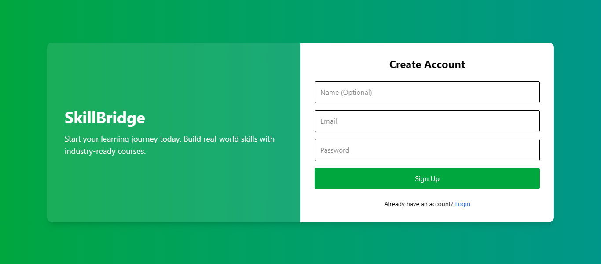
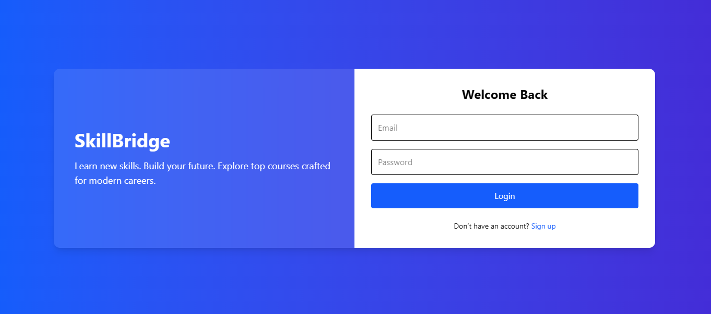
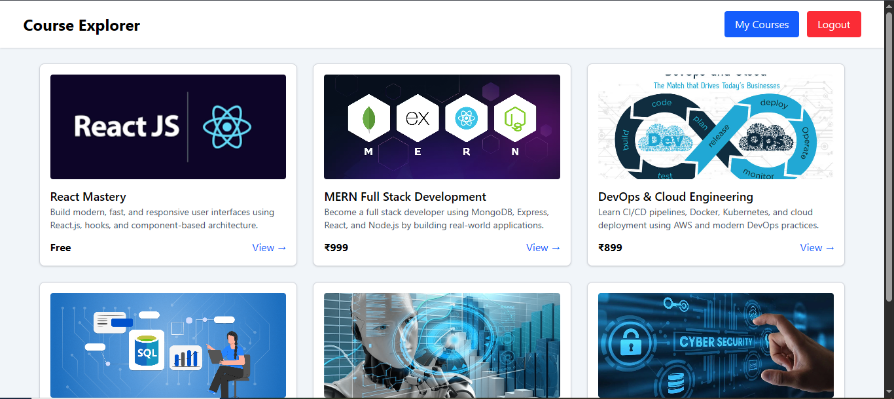
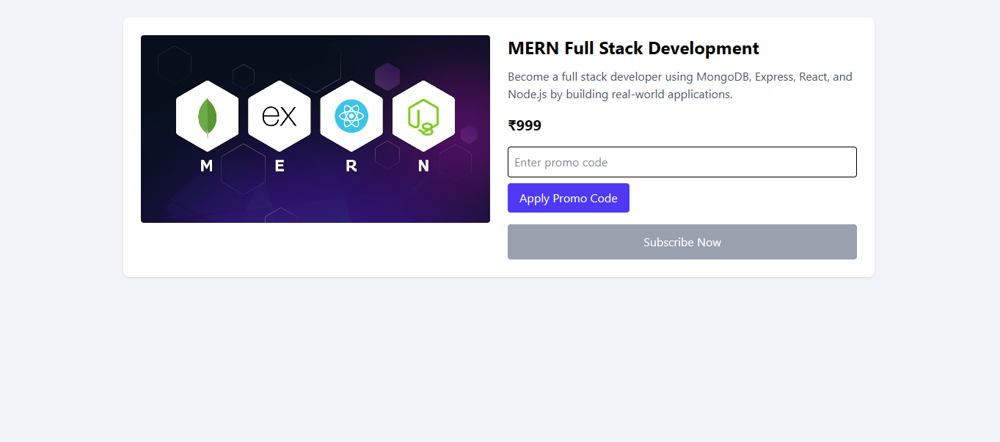
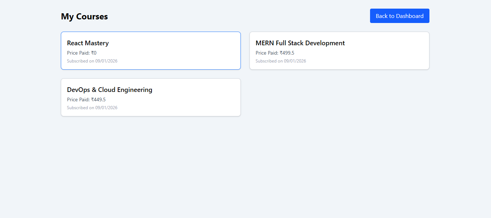

# 📚 SkillBridge – Mini Course Subscription Platform

A full-stack MERN application where users can explore courses, apply promo codes, subscribe, and manage their learning — built as part of an internship technical assignment.

---

## 🚀 Live Demo

- **Application:** https://course-frontend-xvuw.onrender.com  
- **Backend:** https://course-backend-9hci.onrender.com  
- **GitHub Repo:** https://github.com/Karthikm-10/course-subscription-app  

---

## 🧩 Features

### 🔐 Authentication
- User Signup & Login (JWT-based)
- Protected routes

### 📦 Courses
- Browse available courses  
- View detailed course information  
- Course images for better UI  

### 💸 Subscription System
- Subscribe to Free & Paid courses  
- Promo Code: **BFSALE25** → 50% discount  
- Prevents duplicate subscriptions  

### 🧑‍🎓 My Courses
- View all subscribed courses  
- Displays price paid and subscription date  

### 🎨 UI & UX
- Fully responsive dashboard  
- Styled with Tailwind CSS  
- Toast notifications  
- Loading states & smooth transitions  

---

## 🛠 Tech Stack

### Frontend
- React (Vite)  
- Tailwind CSS  
- React Router  
- Axios  
- React Toastify  

### Backend
- Node.js  
- Express.js  
- MongoDB  
- Mongoose  
- JWT Authentication  

### Deployment
- Frontend: Render  
- Backend: Render  
- Database: MongoDB Atlas  

---

## ⚙️ Environment Variables

### Backend (`.env`)
MONGO_URI=your_mongodb_uri
JWT_SECRET=your_jwt_secret


### Frontend

Update `src/config.js`:

```js
export const API = "your_backend_url";

🧪 How to Run Locally
Backend
cd backend
npm install
npm start

Frontend
cd frontend
npm install
npm run dev

🖼 Screenshots

Place screenshots in the screenshots folder:

/screenshots
├── signup.png
├── login.png
├── home.png
├── courseDetails.png
├── appliedPromo.png
└── mycourses.png


Then render them here:








📝 Assignment Notes

This project demonstrates secure authentication, course subscription workflows, promo code validation, and a production-ready UI/UX as part of an internship technical assignment.

🔑 Demo Credentials

Email: test@mail.com
Password: test@123